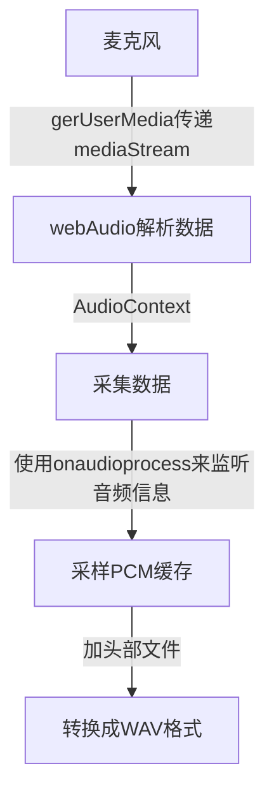

## 云文档开发笔记-录制音频

我首先想到的就是使用WebRTC，如果使用WebRTC我们首先要请求麦克风权限。
```js
window.navigator.mediaDevices.getUserMedia({
  audio: true
}).then(mediaStream => {
  beginRecord(mediaStream);
}).catch(err => {
    console.log(err)
});
```
这里输出的mediaStream其实就可以直接传递给audio标签的src属性使用。
```js
<!DOCTYPE html>
<html lang="en">
<head>
  <meta charset="UTF-8">
  <meta http-equiv="X-UA-Compatible" content="IE=edge">
  <meta name="viewport" content="width=device-width, initial-scale=1.0">
  <title>Document</title>
</head>
<body>
  <audio id="local-audio" autoplay controls>播放麦克风捕获的声音</audio>
  <button id="playAudio">打开麦克风</button>
  <script>
    document.getElementById('playAudio').addEventListener('click',()=>{
      window.navigator.mediaDevices.getUserMedia({
        audio: true
      }).then(mediaStream => {
        document.getElementById('local-audio').srcObject = mediaStream;
      }).catch(err => {
        console.log(err);
      });
    })
  </script>
</body>
</html>
```
我们看上面的代码，当我们点击打开麦克风的时候，就可以使audio标签一直捕获我们的声音播放，但是问题就是，如果没戴耳机的情况下会有回音，而且，我们要做的肯定也不是直接捕获播放，而是要收集起来，点击播放的时候再播放。

当我们获取得到`mediaStream`数据后我们也可以采取下面的方法直接播放
audioContext.createMediaStreamSource需要传入一个媒体流，然后对音频执行播放的操作。
```js
let audioContext = new (window.AudioContext || window.webkitAudioContext);
let mediaNode = audioContext.createMediaStreamSource(mediaStream);
mediaNode.connect(audioContext.destination);
```

保存音频信息的话，我采用了PCM格式，音频的信息就相当于一连串的电信号变化，有许多[-1,1]之间的数字组成的波。如果需要播放就要转成PCM格式。



我们利用`audioContext.createScriptProcessor`来创建缓存节点，
```ts
//创建AudioContext，将获取麦克风权限的stream传递给AudioContext
//并创建jsNode用来收集信息，将jsNode连接
//开始录音，调用该函数，将recorder函数返回的msg传递进去
beginRecord(mediaStream:MediaStream){
  let audioContext = new window.AudioContext;
  let mediaNode = audioContext.createMediaStreamSource(mediaStream);
  // 创建一个jsNode
  let jsNode = this.createJSNode(audioContext);
  this.jsNodes = jsNode;
  // 需要连到扬声器消费掉outputBuffer，process回调才能触发
  // 并且由于不给outputBuffer设置内容，所以扬声器不会播放出声音
  jsNode.connect(audioContext.destination);
  jsNode.onaudioprocess = this.onAudioProcess;
  // 把mediaNode连接到jsNode
  mediaNode.connect(jsNode);
}

//创建jsNode
createJSNode (audioContext:AudioContext) {
  const BUFFER_SIZE = 4096;
  const INPUT_CHANNEL_COUNT = 2;
  const OUTPUT_CHANNEL_COUNT = 2;
  // createJavaScriptNode已被废弃
  //@ts-ignore
  let creator = audioContext.createScriptProcessor || audioContext.createJavaScriptNode;
  creator = creator.bind(audioContext);
  return creator(BUFFER_SIZE,INPUT_CHANNEL_COUNT, OUTPUT_CHANNEL_COUNT);
}
```

我们主要使用`onaudioprocess`来监听音频信息。
```ts
//收集录音信息，大概0.09s调用一次
onAudioProcess (event:any) {
  let audioBuffer = event.inputBuffer;
  //左声道
  let leftChannelData = audioBuffer.getChannelData(0);
  //右声道
  let rightChannelData = audioBuffer.getChannelData(1);
  leftDataList.push([...leftChannelData]);
  rightDataList.push([...rightChannelData]);
}
```
这里在全局定义`leftChannelData`和`rightChannelData`两个数组，来缓存音频信息，大概每0.09s调用一下onAudioProcess函数。

因为我们在上面向`leftChannelData`和`rightChannelData`中`push`的是数组，所以我们要先将`leftChannelData`和`rightChannelData`扁平化，合并成一个`Float32Array`数组。

```ts
//停止录音
stopRecord () {
  //合并左右声道
  let leftData = this.mergeArray(leftDataList),
      rightData = this.mergeArray(rightDataList);
  //交叉合并左右声道
  let allData = this.interleaveLeftAndRight(leftData, rightData);
  let wavBuffer = this.createWavFile(allData);
  return this.playRecord(wavBuffer);
}
//合并左声道和右声道
mergeArray (list:any[]) {
  let length = list.length * list[0].length;
  let data = new Float32Array(length),
      offset = 0;
  for (let i = 0; i < list.length; i++) {
      data.set(list[i], offset);
      offset += list[i].length;
  }
  return data;
}
```

我们将还要将左右声道交叉合并。

```ts
//交叉合并左右声道
interleaveLeftAndRight (left:Float32Array, right:Float32Array) {
  let totalLength = left.length + right.length;
  let data = new Float32Array(totalLength);
  for (let i = 0; i < left.length; i++) {
      let k = i * 2;
      data[k] = left[i];
      data[k + 1] = right[i];
  }
  return data;
}
```

此时我们就可以创建一个WAV文件了。

我们先写入WAV文件固定的头部。
```ts
createWavFile (audioData:Float32Array) {
  const WAV_HEAD_SIZE = 44;
  let buffer = new ArrayBuffer(audioData.length * 2 + WAV_HEAD_SIZE),
      view = new DataView(buffer);
  this.writeUTFBytes(view, 0, 'RIFF');
  view.setUint32(4, 44 + audioData.length * 2, true);
  this.writeUTFBytes(view, 8, 'WAVE');
  this.writeUTFBytes(view, 12, 'fmt ');
  view.setUint32(16, 16, true);
  view.setUint16(20, 1, true);
  view.setUint16(22, 2, true);
  view.setUint32(24, 44100, true);
  view.setUint32(28, 44100 * 2, true);
  view.setUint16(32, 2 * 2, true);
  view.setUint16(34, 16, true);
  this.writeUTFBytes(view, 36, 'data');
  view.setUint32(40, audioData.length * 2, true);

  // 写入PCM数据
  let length = audioData.length;
  let index = 44;
  let volume = 1;
  for (let i = 0; i < length; i++) {
      view.setInt16(index, audioData[i] * (0x7FFF * volume), true);
      index += 2;
  }
  return buffer;
}

writeUTFBytes (view:DataView, offset:number, string:string) {
  var lng = string.length;
  for (var i = 0; i < lng; i++) { 
      view.setUint8(offset + i, string.charCodeAt(i));
  }
}
```

最后写入刚刚录制的音频数据，我们采用16位二进制来表示声音的强弱，16位表示的范围是[-32768, +32767]，最大值是32767即0x7FFF，录音数据的取值范围是[-1, 1]。

```ts
function createWavFile (audioData) {
    // 写入wav头部，代码同上
    // 写入PCM数据
    let length = audioData.length;
    let index = 44;
    let volume = 1;
    for (let i = 0; i < length; i++) {
        view.setInt16(index, audioData[i] * (0x7FFF * volume), true);
        index += 2;
    }
    return buffer;
}
```

最后生成本地的blob url返回。
```ts
//返回src
playRecord (arrayBuffer:ArrayBuffer) {
  let blob = new Blob([new Uint8Array(arrayBuffer)]);
  let blobUrl = URL.createObjectURL(blob);
  return blobUrl;
}
```

## 完整代码
```ts
enum status {
  success = 200,
  error = 500
}

let leftDataList:any[] = [];
let rightDataList:any[] = [];

//录音
export class Audio{
  static instance:any;
  public mediaStreams:MediaStream | undefined;
  public jsNodes:ScriptProcessorNode | undefined;

  constructor(){}

  //初始化，单例模式
  static init():Audio{
    if(!this.instance){
      this.instance = new Audio();
    }
    return this.instance;
  }

  //获取麦克风权限
  recorder () {
    return new Promise<{code: status,msg: MediaStream}>((resolve,reject)=>{
      window.navigator.mediaDevices.getUserMedia({
        audio: true
      }).then(mediaStream => {
        this.mediaStreams = mediaStream;
        resolve({
          code: status.success,
          msg: mediaStream
        });
      }).catch(err => {
          reject({
            code: status.error,
            msg: err
          })
      });
    })
  }

  //创建AudioContext，将获取麦克风权限的stream传递给AudioContext
  //并创建jsNode用来收集信息，将jsNode连接
  //开始录音，调用该函数，将recorder函数返回的msg传递进去
  beginRecord(mediaStream:MediaStream){
    let audioContext = new window.AudioContext;
    let mediaNode = audioContext.createMediaStreamSource(mediaStream);
    // 创建一个jsNode
    let jsNode = this.createJSNode(audioContext);
    this.jsNodes = jsNode;
    // 需要连到扬声器消费掉outputBuffer，process回调才能触发
    // 并且由于不给outputBuffer设置内容，所以扬声器不会播放出声音
    jsNode.connect(audioContext.destination);
    jsNode.onaudioprocess = this.onAudioProcess;
    // 把mediaNode连接到jsNode
    mediaNode.connect(jsNode);
  }

  //创建jsNode
  createJSNode (audioContext:AudioContext) {
    const BUFFER_SIZE = 4096;
    const INPUT_CHANNEL_COUNT = 2;
    const OUTPUT_CHANNEL_COUNT = 2;
    // createJavaScriptNode已被废弃
    //@ts-ignore
    let creator = audioContext.createScriptProcessor || audioContext.createJavaScriptNode;
    creator = creator.bind(audioContext);
    return creator(BUFFER_SIZE,INPUT_CHANNEL_COUNT, OUTPUT_CHANNEL_COUNT);
  }

  //收集录音信息，大概0.09s调用一次
  onAudioProcess (event:any) {
    let audioBuffer = event.inputBuffer;
    //左声道
    let leftChannelData = audioBuffer.getChannelData(0);
    //右声道
    let rightChannelData = audioBuffer.getChannelData(1);
    leftDataList.push([...leftChannelData]);
    rightDataList.push([...rightChannelData]);
  }

  //停止录音
  stopRecord () {
    //合并左右声道
    let leftData = this.mergeArray(leftDataList),
        rightData = this.mergeArray(rightDataList);
    //交叉合并左右声道
    let allData = this.interleaveLeftAndRight(leftData, rightData);
    let wavBuffer = this.createWavFile(allData);
    return this.playRecord(wavBuffer);
  }

  //返回src
  playRecord (arrayBuffer:ArrayBuffer) {
    let blob = new Blob([new Uint8Array(arrayBuffer)]);
    let blobUrl = URL.createObjectURL(blob);
    return blobUrl;
  }

  //合并左声道和右声道
  mergeArray (list:any[]) {
    let length = list.length * list[0].length;
    let data = new Float32Array(length),
        offset = 0;
    for (let i = 0; i < list.length; i++) {
        data.set(list[i], offset);
        offset += list[i].length;
    }
    return data;
  }

  //交叉合并左右声道
  interleaveLeftAndRight (left:Float32Array, right:Float32Array) {
    let totalLength = left.length + right.length;
    let data = new Float32Array(totalLength);
    for (let i = 0; i < left.length; i++) {
        let k = i * 2;
        data[k] = left[i];
        data[k + 1] = right[i];
    }
    return data;
  }

  //将PCM数据转换成wav
  createWavFile (audioData:Float32Array) {
    const WAV_HEAD_SIZE = 44;
    let buffer = new ArrayBuffer(audioData.length * 2 + WAV_HEAD_SIZE),
        view = new DataView(buffer);
    this.writeUTFBytes(view, 0, 'RIFF');
    view.setUint32(4, 44 + audioData.length * 2, true);
    this.writeUTFBytes(view, 8, 'WAVE');
    this.writeUTFBytes(view, 12, 'fmt ');
    view.setUint32(16, 16, true);
    view.setUint16(20, 1, true);
    view.setUint16(22, 2, true);
    view.setUint32(24, 44100, true);
    view.setUint32(28, 44100 * 2, true);
    view.setUint16(32, 2 * 2, true);
    view.setUint16(34, 16, true);
    this.writeUTFBytes(view, 36, 'data');
    view.setUint32(40, audioData.length * 2, true);
  
    // 写入PCM数据
    let length = audioData.length;
    let index = 44;
    let volume = 1;
    for (let i = 0; i < length; i++) {
        view.setInt16(index, audioData[i] * (0x7FFF * volume), true);
        index += 2;
    }
    return buffer;
  }

  writeUTFBytes (view:DataView, offset:number, string:string) {
    var lng = string.length;
    for (var i = 0; i < lng; i++) { 
        view.setUint8(offset + i, string.charCodeAt(i));
    }
  }

}
```

## 在React中调用
```tsx
import { useEffect, useRef } from 'react';
//Audio就是上面的完整代码
import { Audio } from '../../../utils/audio';

export default function ContentAudio() {

  const audioRef = useRef(null);

  useEffect(() => {
    (async function fn(){
      let audio = Audio.init();
      //获取麦克风权限
      let recorder = await audio.recorder();
      //开始录音
      audio.beginRecord(recorder.msg);
      setTimeout(()=>{
        console.log('停止录音');
        let url = audio.stopRecord();
        //@ts-ignore
        audioRef.current.src = url
      },1000)
    })()
  }, [])
  return (
    <div>
      <audio ref={audioRef} src="" id="audio" controls autoPlay></audio>
    </div>
  )
}
```

## 参考资料
[1][前端webrtc基础 —— 录音篇](https://juejin.cn/post/6844903953381982222)
[2][如何实现前端录音功能](https://juejin.cn/post/6844903668588740621)