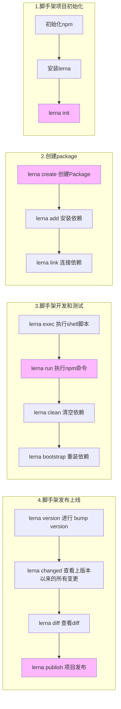

## Lerna

&ensp;&ensp;&ensp;&ensp;Lerna是一个优化基于git+npm的多pagkage项目的管理工具

- 解决的痛点
  - 痛点一:重复操作
    + 多Package本地link
    + 多Package依赖安装
    + 多Package单元测试
    + 多Package代码提交
    + 多Package代码发布
  - 痛点二:版本一致性
    + 发布时版本一 致性
    + 发布后相互依赖版本升级

> package越多，管理复杂度越高

- 优势
  + 大幅减少重复操作
  + 提升操作的标准化

<p style="color:red">*lerna开发脚手架流程<p>

[lerna命令语法文档](https://gitcode.gitcode.host/docs-cn/lerna-docs-cn/commands/add/index.html)



1. 脚手架项目初始化

   ```yaml
   npm init -y
   npm i -g lerna
   lerna init
   ```

2. 创建package

   ```yaml
   lerna create core # 输入命令后会让填写package name，请不要填写成默认的core为name，可以写成@项目名/core，之后一路回车
   lerna create utils # 步骤和上一条命令一样
   
   # 在npm上创建组织，组织名为上两条命令的@后面的项目名
   # 点击npm头像，点击Add Organization，点击输入项目名，点击create，点击跳过。组织创建完毕。
   
   lerna add 依赖名 # 为每个packages安装依赖
   lerna add 依赖名 路径名[packages/core/] # 为单个packages安装依赖
   
   lerna link 
   # 直接执行lerna link是无效的
   # 以将utils目录下的lib/utils.js改成lib/index.js
   # utils目录下的package.json的"main": "lib/utils.js"改成"main": "lib/index.js"
   # 在core目录下的package.json中写入"dependencies": {"@pale-cli-dev/utils": "^1.0.0"}
   # 之后再执行lerna link，就会发现在core目录下多了一个node_modules目录，就是utils的软连接
   ```

3. 脚手架开发和测试

   ```yaml
   lerna exec -- rm -rf node_modules/ 
   # 删除packages下的所有node_modules，而不是根目录下的node_modules
   lerna exec --scope 包名[@pale-cli-dev/core] -- rm -rf node_modules. 
   # 删除packages下core中的node_modules
   
   lerna run 脚本名(package.json中script中的属性) # 执行每个packages的脚本命令
   lerna run --scope 包名[@pale-cli-dev/core] 脚本名 # 执行对应包名下的脚本命令
   
   lerna clean 
   # 清空添加的依赖 lerna clean只能去除掉packages下的node_modules，但是不会去除package.json中写入的dependencies
   
   lerna bootstrap 
   # 重装依赖 也可以重装链接（link） 但是需要在lerna.json中设置"useWorkspaces": false，不然会显示lerna info bootstrap root only，而不会进入packages中
   ```

4. 脚手架发布上线

   ```yaml
   lerna version # 升级版本 需要将代码commite仓库后才能运行
   
   lerna changed # 自上一个版本以来 哪些packages进行了变更
   
   lerna diff # 
   
   lerna publish # 发布项目 注意在第二条创建package中需要进行组织的创建
   ```

5. 关于lerna publish的一些报错

   ```yaml
   lerna ERR! E401 [UNAUTHORIZED] Login first，需要将npm设置成原本的镜像npm config set registry https://registry.npmjs.org
   
   lerna ERR! E426 426 Upgrade Required - PUT http://registry.npmjs.org/@pale-cli-dev%2futils 设置的镜像不正确，是https而不是http
   
   最好不要修改版本号，因为虽然npm没有发布成功但是github仓库会有不同版本的tag，如果版本相同也不会发布成功
   
   如果项目中没有修改，内容和上次版本一样，也不会发布成功
   ```
   
   